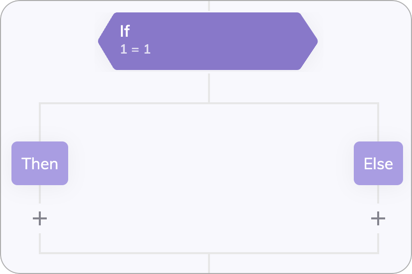
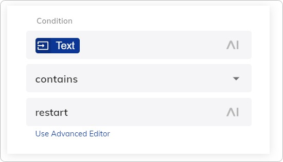
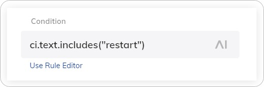

# If

<Frame>
  
</Frame>

## Description

This Node executes either one or another part of a [Flow](../../../build/flows/overview.md) based on a condition. An If Node has two child Nodes: a _Then Node_ and an _Else Node_. The condition is evaluated during the execution of the Flow. If the condition evaluates to `true`, the Flow takes the path of the Then Node, if it evaluates to `false` the path of the Else Node is executed. 

## Parameters

### Condition Field
  
In the **Condition** field, use [CognigyScript](../../cognigyscript.md) without `{{ "{{ }}" }}`. For example, `input.slots.city` is all that is required. This evaluates to `true` if an Input Keyphrase with the tag `city` is found.

### Rule Editor

The Rule editor allows you to quickly create simple conditions.
<Frame>
  
</Frame>

### Advanced Editor

The Advanced editor allows you to write Conditions that go beyond one comparison.
<Frame>
  
</Frame>